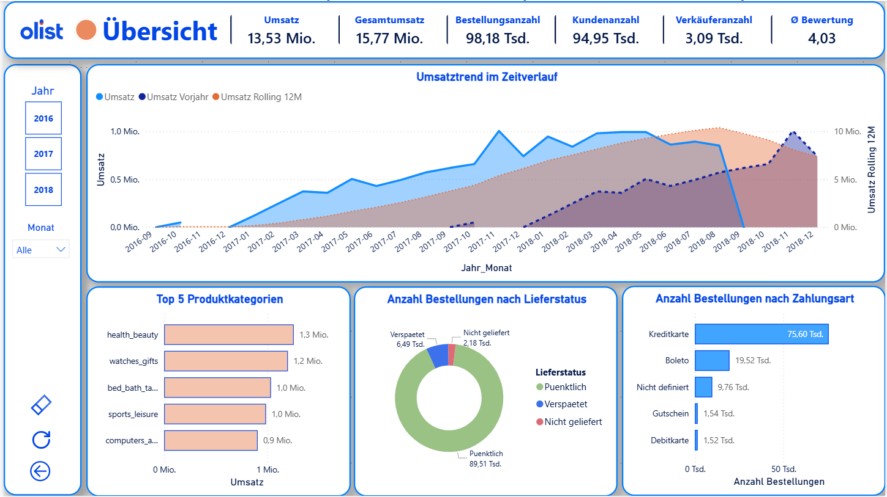
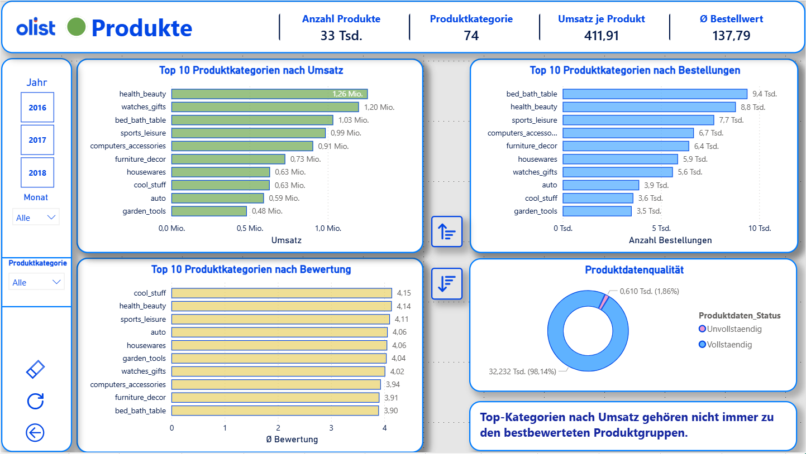
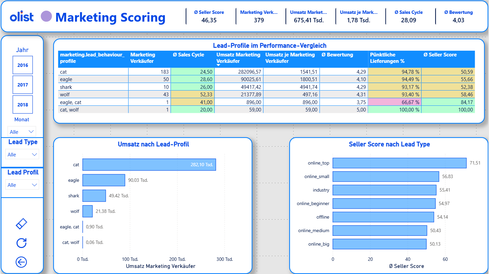
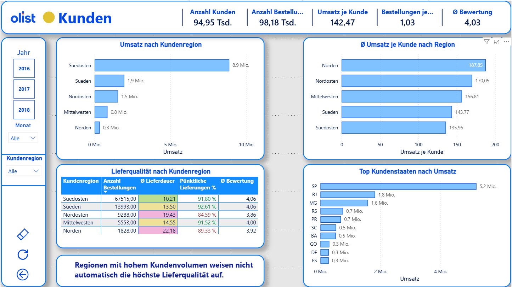
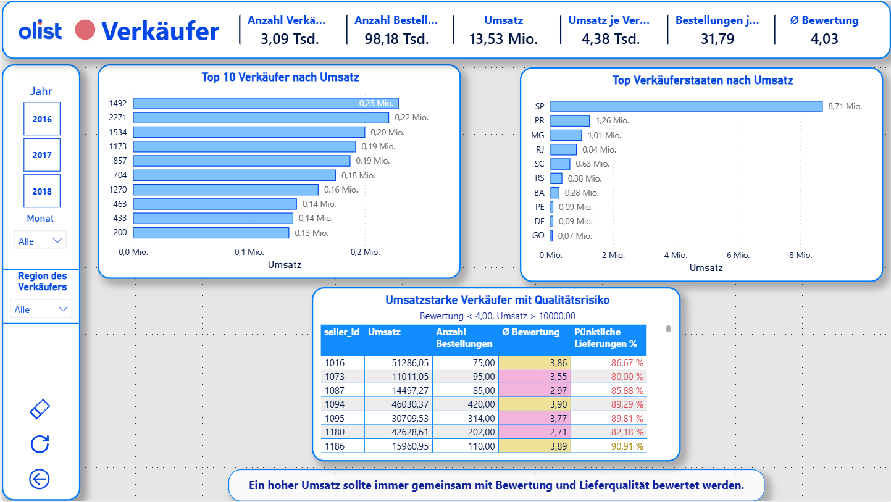
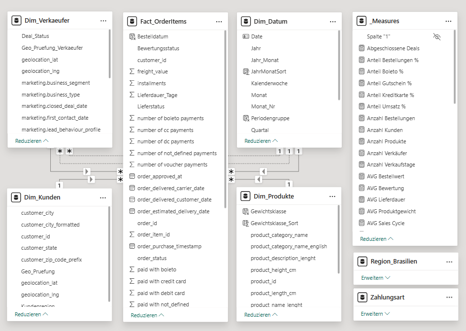

# 📊 Olist Power BI Sales & Marketing Analysis

## Projektübersicht

Olist Power BI Sales & Marketing Analysis ist ein Business-Intelligence-Projekt zur Analyse von E-Commerce-Daten des brasilianischen Online-Marktplatzes Olist.

Ziel des Projekts war es, Verkaufs-, Kunden-, Produkt-, Marketing- und Lieferdaten in einem interaktiven Power-BI-Dashboard zusammenzuführen und daraus geschäftsrelevante Erkenntnisse abzuleiten.

Das Dashboard ermöglicht die Analyse zentraler KPIs sowie die Identifikation von Umsatztreibern, regionalen Unterschieden, Produktperformance und Marketingeffizienz.

---

## Dashboard-Bereiche

### Übersicht

Die Hauptseite bietet einen schnellen Überblick über die wichtigsten Geschäftskennzahlen:

* Umsatz
* Gesamtumsatz
* Anzahl Bestellungen
* Anzahl Kunden
* Anzahl Verkäufer
* Durchschnittliche Bewertung

Zusätzlich werden Umsatztrends, Lieferstatus und Zahlungsarten analysiert.



---

### Produktanalyse

Analyse der Produktperformance anhand verschiedener Kennzahlen:

* Top-Produktkategorien nach Umsatz
* Produktkategorien nach Bestellungen
* Produktbewertungen
* Datenqualität der Produktdaten

Die Analyse zeigt, dass hohe Umsätze nicht automatisch mit den besten Kundenbewertungen einhergehen.



---

### Marketing Scoring

Entwicklung eines Seller-Scoring-Modells zur Bewertung von Marketing- und Vertriebsperformance.

Analysiert werden:

* Lead-Profile
* Umsatz pro Marketing-Verkäufer
* Sales Cycle
* Seller Score
* Lieferqualität

Dadurch lassen sich besonders erfolgreiche Lead-Typen und Marketingkanäle identifizieren.



---

### Kunden- und Lieferanalyse

Analyse regionaler Unterschiede bei Kundenverhalten und Lieferqualität.

Untersucht werden:

* Umsatz nach Kundenregion
* Umsatz pro Kunde
* Lieferdauer
* Pünktliche Lieferungen
* Umsatzstärkste Bundesstaaten

Die Ergebnisse zeigen deutliche regionale Unterschiede hinsichtlich Umsatz und Lieferperformance.



---

### Verkäuferanalyse

Bewertung der Verkäuferleistung anhand von Umsatz-, Qualitäts- und Lieferkennzahlen.

Die Analyse identifiziert:

* Top-Verkäufer nach Umsatz
* Umsatzstarke Verkäufer mit Qualitätsrisiken
* Verkäuferregionen
* Lieferqualität

So können potenzielle Risiken trotz hoher Verkaufszahlen frühzeitig erkannt werden.



---

## Datenmodell

Das Dashboard basiert auf einem Star-Schema-Datenmodell mit zentraler Faktentabelle und mehreren Dimensionstabellen.

Verwendete Tabellen:

* Fact_OrderItems
* Dim_Kunden
* Dim_Verkaeufer
* Dim_Produkte
* Dim_Datum
* Region_Brasilien
* Zahlungsart

Zusätzlich wurden zahlreiche DAX-Measures zur KPI-Berechnung entwickelt.



---

## Verwendete Technologien

* Power BI
* Power Query
* DAX
* Datenmodellierung (Star Schema)
* KPI-Design
* Business Intelligence
* Datenvisualisierung

---

## Zentrale Erkenntnisse

* Der Großteil des Umsatzes wird in der Region Südosten Brasiliens erzielt.
* Umsatzstarke Produktkategorien besitzen nicht zwangsläufig die höchsten Bewertungen.
* Hohe Verkaufszahlen garantieren keine hohe Lieferqualität.
* Marketing-Lead-Profile unterscheiden sich deutlich hinsichtlich Umsatzpotenzial und Performance.
* Verkäufer mit hohen Umsätzen können gleichzeitig Qualitäts- oder Lieferprobleme aufweisen.

---

## Projektstruktur

```text
olist-powerbi-sales-marketing-analysis/
│
├── dashboard/
│   └── Olist_Sales_Marketing_Analysis.pbix
│
├── data/
│   └── Olist_Dataset.csv
│
├── images/
│   ├── dashboard_overview.png
│   ├── product_analysis.png
│   ├── marketing_scoring_model.png
│   ├── customer_delivery_analysis.png
│   ├── seller_analysis.png
│   └── data_model.png
│
├── presentation/
│   └── Projektpraesentation.pdf
│
└── README.md
```

---

## Beitrag

Dieses Projekt wurde im Rahmen einer Data-Analytics-Weiterbildung als Teamprojekt entwickelt.

Mein Schwerpunkt lag auf:

* Power BI Dashboard-Entwicklung
* KPI-Konzeption
* Datenanalyse
* Datenvisualisierung
* Dokumentation und Präsentation

---

## Kontakt

Natalia Melnytska

Data Analytics | Power BI | SQL | Python

GitHub:
https://github.com/Natali-mary
